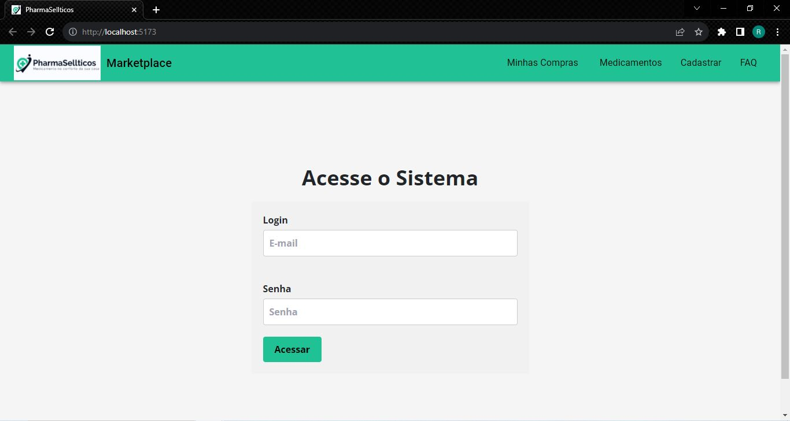
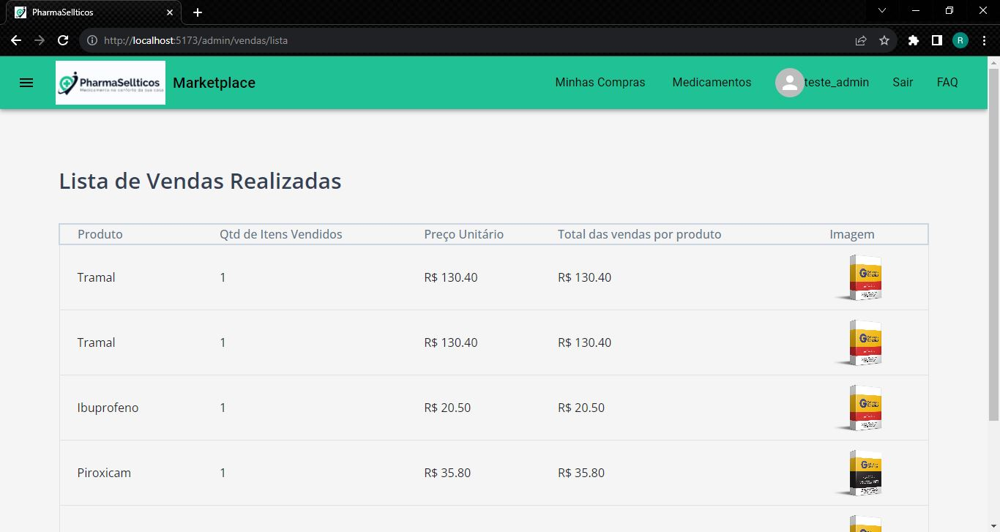

# M3P-FrontEnd-Squad2
# LAB365-FullStack-M03-ProjetoFinal-Marketplace de Medicamentos
## Projeto Avaliativo do Módulo3
## LAB365- FullStack - Itaguaçu
### Projeto realizado em squad, formado pelos alunos desenvolvedores:
- Carlos Henrique Moreira Junior (Github - https://www.github.com/chmjr)
- Debora Patricia Santos de Souza (Github - https://www.github.com/deborasous )
- Rafael Zampieron (Github - https://www.github.com/rafazamp )
- Ricardo Werner Grosscklauss (Github - https://www.github.com/ricado-werner)

#### Criação de sistema de Marketplace (E-Commerce):
- Frontend - React.JS
- Backend - Node.JS, Express, Sequelize em banco de dados PostgreSQL

#### Nome do sistema: PharmaSellticos
<p align="center">
  
</p>

### 🔗 Links
link das redes sociais dos participantes


Status - Finalizado

### Demonstração

Estrutura geral do front-end do "SISTEMA"

Tela do FrontEnd do "SISTEMA"
<p align="center">
  
</p>

Tela do Administrador - Sidebar
<p align="center">
  
</p>

Tela do Administrador Inicial - Dashboard
<p align="center">
  
</p>

Telas do Administrador - Cadastro e Listagem de Medicamentos
<p align="center">
  
</p>

Tela do Adminstrador - Listagem de Vendas
<p align="center">
  
</p>

Tela do Adminstrador - Cadastro de Usuário
<p align="center">
  
</p>

Tela do Comprador Inicial - Listagem de Medicamentos  
<p align="center">
  
</p>

Tela do Comprador - Minhas Vendas 
<p align="center">
    <!--img width="480" src="src/assets/to_readme/PharmaCentralSystem.gif"-->
</p>

### O Desafio
Neste projeto, desenvolvemos um sistema completo de Marketplace para produtos farmacêuticos, gerenciando múltiplos vendedores, clientes e vendas de forma online, utilizando React.JS e Node.JS.

### Requisitos da Aplicação

| Item | Descrição                                                                    |
| ---- | ---------------------------------------------------------------------------- |
| 1    | O sistema deverá ser desenvolvido em React.                                  |
| 2    | O sistema deverá seguir o Roteiro da Aplicação.                              |
| 3    | Modelagem do layout, formatos, tipografias. cores e organização livre.       |
| 3.1  | Opcional a utilização do Bootstrap ou Style components.                      |
| 4    | Ser planejado utilizando o modelo Kanban na ferramenta Trello.               |
| 5    | Ser versionado no GitHub, possuindo uma documentação detalhada no readme.md. |
| 6    | Deverá ser criado um pith de apresentação de 15 minutos.                     |

### Formato do Sistema

#### Front-end

| Item                       | Descrição                                                                                                                                |
| -------------------------- | ---------------------------------------------------------------------------------------------------------------------------------------- |
| Login                      | Pág. de acesso do Administrador e Comprador, com email e senha obrigatórios.                                                             |
| Dashboard                  | Pág. inicial de usuário Administrador logado.                                                                                            |
| Sidebar                    | Pág. com menu lateral de acesso exclusivo do Administrador logado.                                                                       |
| Menu Sidebar               | Itens de acesso rápido para páginas de cadastro de medicamento, lista de vendas, dashboard e cadastro de novo usuário                    |
| Menu Cadastrar Medicamento | Pág. do Administrador para cadastro de novo medicamento, com dados completos e a possibilidade de editar medicamento cadastrado.         |
| Menu Lista de Vendas       | Pág. do Administrador para visualização das vendas realizadas por produto e quantidade.                                                  |
| Menu Usuários              | Pág. do Administrador para o cadastro de novo usuário, com listagem de todos os usuários cadastrados no sistema.                         |
| Navbar                     | Barra superior da página com logo e links para as principais página do usuário Comprador logado.                                         |
| Menu Minhas Compras        | Pág. contendo todas as compras realizadas pelo usuário, mostradas pelo dia da compra com detalhamento ao se clicar sobre o dia da compra |
| Menu Medicamentos          | Pág. contendo a listagem dos medicamentos disponíveis no estoque, com acesso ao carrinho de compras e pagamento                          |
| Menu FAQ (Extra)           | Pág. de Perguntas mais frequentes para se utilizar o sistema                                                                             |
| Deploy                     | Serviço de implementação de uma aplicação em ambiente de produção, de forma confiável, segura e eficiente para uso real.                 |

###Link de acesso:
- Deploy
- Front: https://projeto03front.onrender.com/


### Plano do Projeto

No desenvolvimento desta aplicação, colocamos em prática:

| Item | Descrição  |
| ---- | ---------- |
| 1    | HTML       |
| 2    | CSS        |
| 3    | JavaScript |
| 3.1  | React.JS   |
| 4    | Deploy     |
| 5    | Skills     |
| 6    | Squad      |

### Tecnologias utilizadas:

- Visual Studio Code
- NodeJS (compilação Vite - página oficial - https://vitejs.dev/ )
- Trello


## Para utilizar este projeto como base, faça o seguinte passo-a-passo:

### Nota - Para que o sistema funcione corretamente, primeiramente é necessário ter instalado no seu computador:
- Node.JS
- Node Package Manager(NPM)
- PostgreSQL (Base de dados)
- DBeaver (Gerenciador de banco de dados)

Clone o projeto para a sua máquina
```bash
gh repo clone FullStack-Itaguacu/M3P-FrontEnd-Squad2
```

Instale as dependências.

###Frontend

```bash
npm install
``` 

- Rode o projeto

```bash
npm run dev
```

### Observações

Este projeto já vem com o Bootstrap 5 e react-bootstrap instalado e configurado.


## Autores:
```bash
Turma: Full-Stack - Itaguaçu
Squad: ItaguaDevs
Mentoria: Prof. Pedro Henrique Silva
Senai/SC: Serviço Nacional de Aprendizagem Industrial
LAB365: espaço do @senai.sc para desenvolver as habilidades do futuro
Floripa Mais Tech - Iniciativa da Prefeitura de Florianópolis - SC
```
